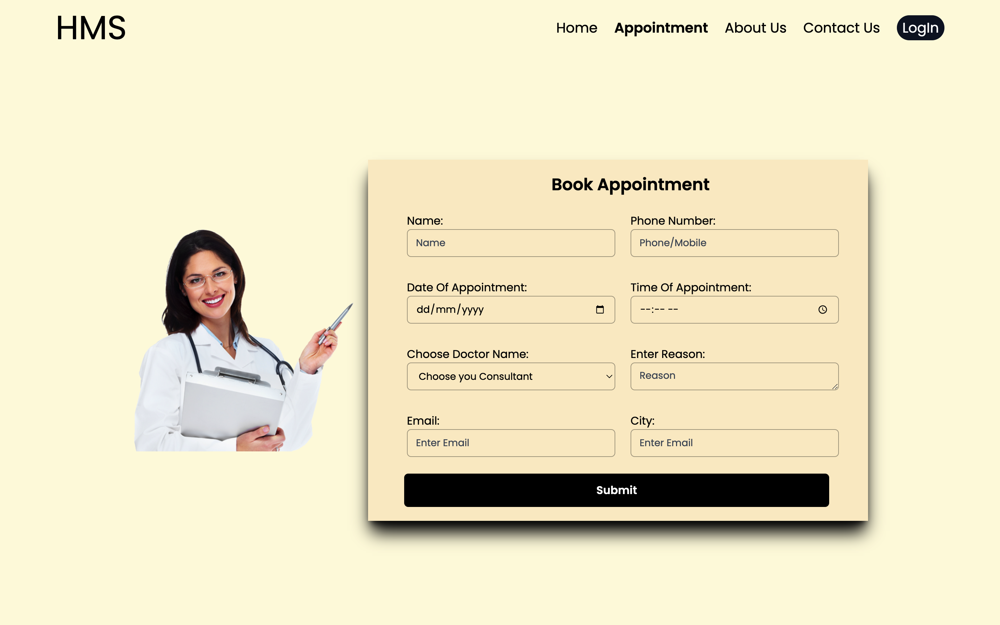
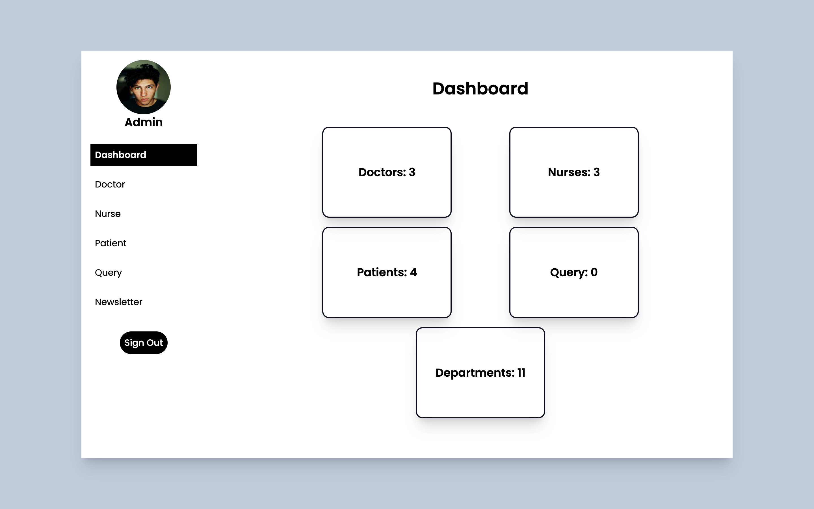

# Hospital Management System using MERN Stack,Redux, TailwindCSS and Framer Motion


## Overview

This Hospital Management System is a web application developed using the MERN (MongoDB, Express.js, React, Node.js) stack with Redux for state management and TailwindCSS for responsive UI design. The system aims to streamline hospital operations, improve patient care, and enhance overall efficiency.



## Features

- **User Authentication**: Secure user authentication system for administrators, doctors, and staff members.
- **Patient Management**: Easily manage patient records, including admission, discharge, and medical history.
- **Appointment Scheduling**: Efficiently schedule and manage patient appointments with doctors.
- **Inventory Management**: Keep track of medical supplies and equipment inventory.
- **Billing System**: Generate and manage invoices for patient services.
- **Reports and Analytics**: Generate insightful reports and analytics for better decision-making.
- **Responsive Design**: Taileing is used for a desktop-friendly and responsive user interface.

## Prerequisites

Before you begin, ensure you have the following installed:

- [Node.js](https://nodejs.org/)
- [MongoDB](https://www.mongodb.com/try/download/community)

## Getting Started

1. **Clone the repository:**

   ```bash
   git clone https://github.com/all3n2601/HMSMern.git
   ```
2. **Navigate to the project directory:

   ```bash
   cd frontend
   ```
3. **Install dependencies:

   ```bash
   npm install
   ```
4. **Set up MongoDB:
   - Create a MongoDB database.
   - Update the MongoDB connection string in env
   - Create a secret jwt key in  server/config/config.js.

5. **Start the application:

   ```bash
   npm run dev
   ```

## Contributing

We welcome contributions! Please follow our contribution guidelines.

## License
This project is licensed under the MIT License.

## Acknowledgments
Thanks to the MERN and Redux TailwindCSS communities for their amazing tools and resources.

## Contact
For any inquiries or issues, please contact [allsurej@gmail.com].

